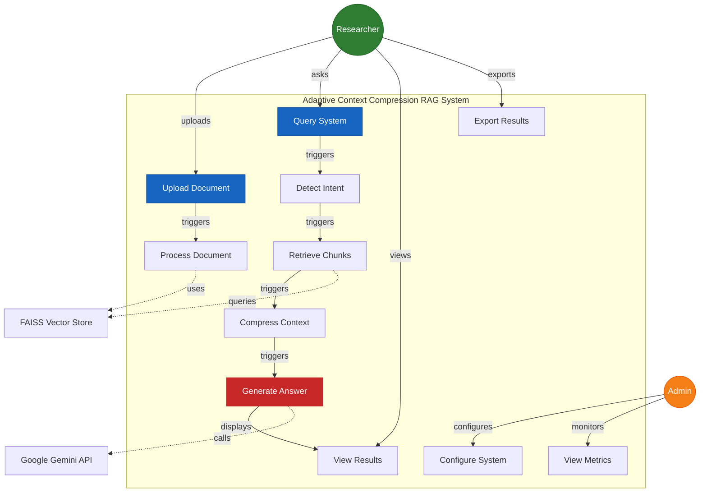
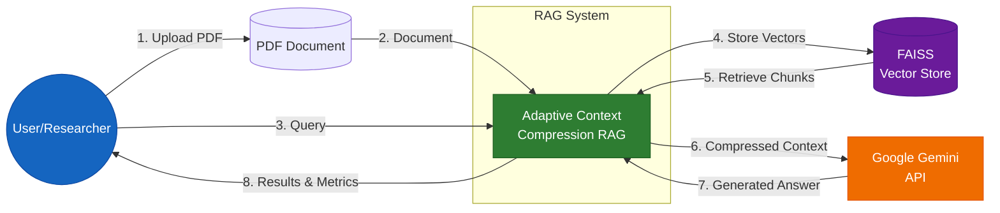
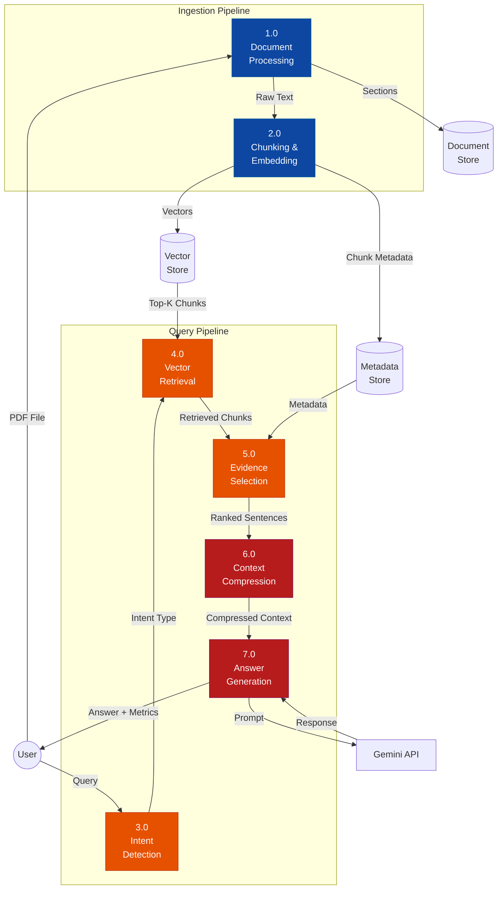
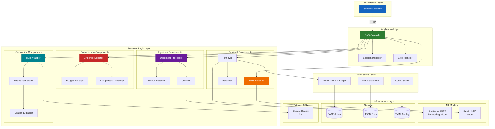
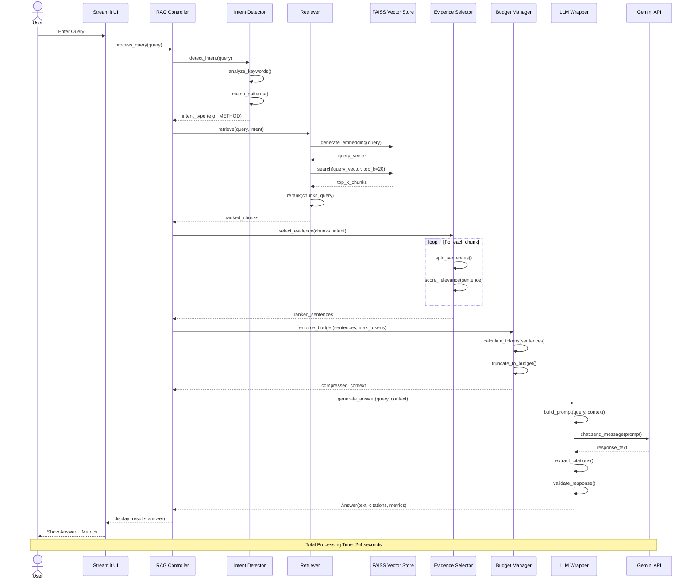
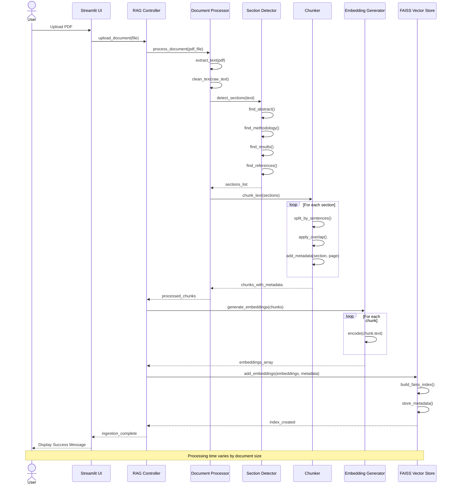
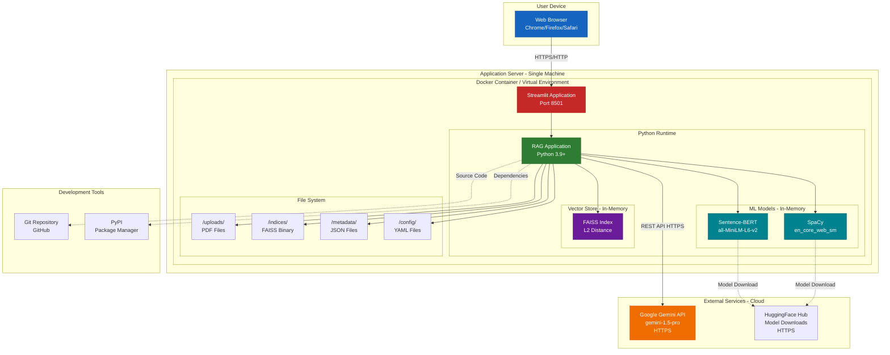
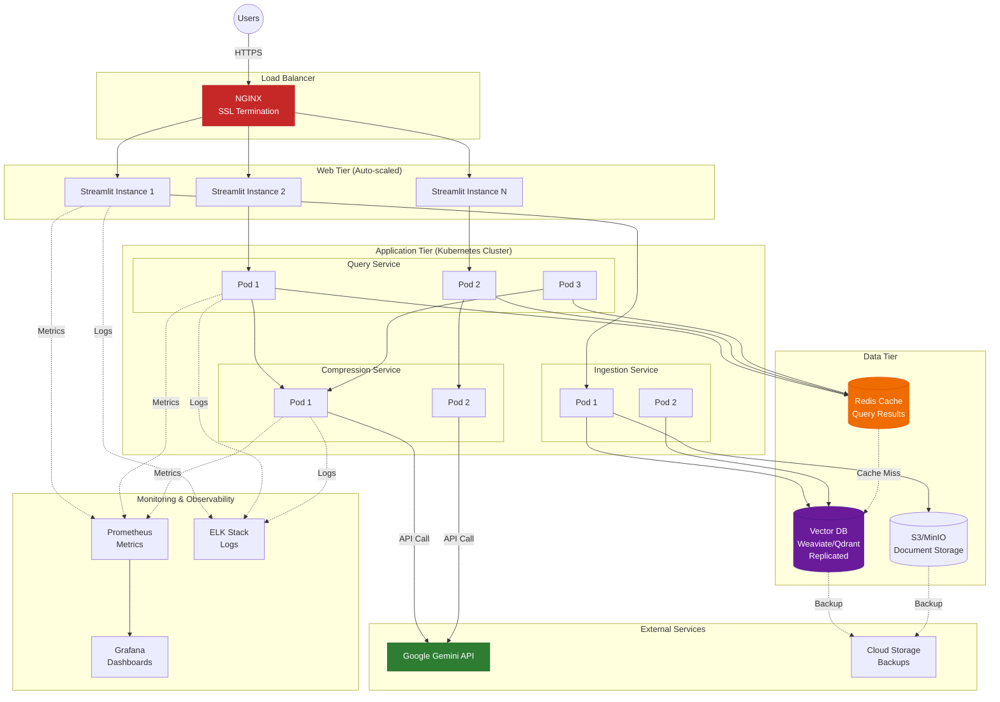

# Adaptive Context Compression RAG System - UML Diagrams

## 1. Use Case Diagram

## 2. Class Diagram

```mermaid
classDiagram
    class RAGController {
        +config: Config
        +pipeline: Pipeline
        +process_query(query: str) Answer
        +upload_document(file: File) bool
        +initialize_system() void
    }
    
    class DocumentProcessor {
        -pdf_parser: PyMuPDF
        +extract_text(pdf: File) str
        +detect_sections(text: str) List~Section~
        +clean_text(text: str) str
    }
    
    class SectionDetector {
        -section_patterns: List~Pattern~
        +detect_abstract(text: str) Section
        +detect_methodology(text: str) Section
        +detect_results(text: str) Section
        +detect_references(text: str) Section
    }
    
    class Chunker {
        -chunk_size: int
        -overlap: int
        +chunk_by_sentence(text: str) List~Chunk~
        +chunk_by_section(sections: List~Section~) List~Chunk~
        +calculate_overlap(chunks: List~Chunk~) void
    }
    
    class EmbeddingGenerator {
        -model: SentenceTransformer
        +generate_embeddings(text: str) ndarray
        +batch_generate(texts: List~str~) List~ndarray~
    }
    
    class VectorStore {
        -index: FAISS
        -metadata: Dict
        +add_embeddings(vectors: List~ndarray~, metadata: Dict) void
        +search(query_vector: ndarray, k: int) List~Chunk~
        +save_index(path: str) void
        +load_index(path: str) void
    }
    
    class IntentDetector {
        -intent_patterns: Dict
        +detect_intent(query: str) Intent
        +classify_query(query: str) str
    }
    
    class Intent {
        <<enumeration>>
        METHOD
        RESULT
        API_USAGE
        DEFINITION
        COMPARISON
    }
    
    class Retriever {
        -vector_store: VectorStore
        -embedding_gen: EmbeddingGenerator
        -top_k: int
        +retrieve(query: str) List~Chunk~
        +rerank(chunks: List~Chunk~, query: str) List~Chunk~
    }
    
    class EvidenceSelector {
        -sentence_splitter: SpaCy
        +select_sentences(chunks: List~Chunk~, intent: Intent) List~Sentence~
        +score_relevance(sentence: str, query: str) float
        +rank_by_position(sentences: List~Sentence~) List~Sentence~
    }
    
    class BudgetManager {
        -max_tokens: int
        -current_usage: int
        +calculate_tokens(text: str) int
        +enforce_budget(evidence: List~Sentence~) List~Sentence~
        +get_compression_ratio() float
    }
    
    class CompressionStrategy {
        <<interface>>
        +compress(chunks: List~Chunk~, budget: int) str
    }
    
    class MethodCompressionStrategy {
        +compress(chunks: List~Chunk~, budget: int) str
        -prioritize_methodology() void
    }
    
    class ResultCompressionStrategy {
        +compress(chunks: List~Chunk~, budget: int) str
        -prioritize_findings() void
    }
    
    class APICompressionStrategy {
        +compress(chunks: List~Chunk~, budget: int) str
        -prioritize_code_examples() void
    }
    
    class LLMWrapper {
        -api_key: str
        -model: str
        +generate_answer(prompt: str, context: str) str
        +validate_response(response: str) bool
    }
    
    class Answer {
        +text: str
        +citations: List~Citation~
        +tokens_used: int
        +compression_ratio: float
        +intent: Intent
    }
    
    class Citation {
        +page_number: int
        +chunk_id: str
        +text_snippet: str
    }
    
    class Chunk {
        +id: str
        +text: str
        +embedding: ndarray
        +metadata: Dict
        +section_type: str
        +page_number: int
    }
    
    class Config {
        +chunk_size: int
        +embedding_model: str
        +llm_model: str
        +max_tokens: int
        +top_k: int
    }
    
    RAGController --> DocumentProcessor
    RAGController --> Retriever
    RAGController --> IntentDetector
    RAGController --> EvidenceSelector
    RAGController --> BudgetManager
    RAGController --> LLMWrapper
    RAGController --> Config
    
    DocumentProcessor --> SectionDetector
    DocumentProcessor --> Chunker
    
    Chunker --> EmbeddingGenerator
    EmbeddingGenerator --> VectorStore
    
    Retriever --> VectorStore
    Retriever --> EmbeddingGenerator
    
    IntentDetector --> Intent
    
    EvidenceSelector --> CompressionStrategy
    CompressionStrategy <|.. MethodCompressionStrategy
    CompressionStrategy <|.. ResultCompressionStrategy
    CompressionStrategy <|.. APICompressionStrategy
    
    BudgetManager --> Answer
    LLMWrapper --> Answer
    Answer --> Citation
    VectorStore --> Chunk
```

## 3. Data Flow Diagram (Level 0 - Context Diagram)

## 3. Data Flow Diagram (Level 1 - System Processes)

## 4. Component Diagram

## 5. Sequence Diagram - Query Processing Flow

## 6. Sequence Diagram - Document Ingestion Flow

## 7. Deployment Diagram

## 8. Deployment Diagram - Production Architecture (Future State)

---

## Summary

This document contains 8 comprehensive diagrams:

1. **Use Case Diagram** - Shows user interactions and system boundaries
2. **Class Diagram** - Detailed object-oriented design with 20+ classes
3. **Data Flow Diagram (Level 0)** - High-level context diagram
4. **Data Flow Diagram (Level 1)** - Detailed process flows
5. **Component Diagram** - System components and their relationships
6. **Sequence Diagram (Query)** - Step-by-step query processing flow
7. **Sequence Diagram (Ingestion)** - Document processing workflow
8. **Deployment Diagram (Current)** - Single-server deployment architecture
9. **Deployment Diagram (Future)** - Microservices production architecture

These diagrams provide a complete architectural view of the Adaptive Context Compression RAG system from multiple perspectives.
